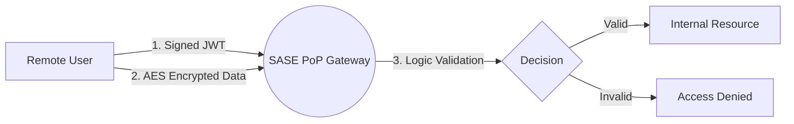

# SASE-ZeroTrust-Lab: The Evolution of Network Security

[](https://www.python.org/)
[](https://fastapi.tiangolo.com/)
[](https://www.docker.com/)
[](https://opensource.org/licenses/MIT)

## Project Overview
This project is a technical proof-of-concept demonstrating the architectural shift from Legacy Perimeter Security (Firewalls) to Secure Access Service Edge (SASE).

In a modern decentralized environment, the traditional "Castle-and-Moat" firewall is no longer sufficient. This lab implements a Software-Defined Perimeter using Zero Trust Network Access (ZTNA) principles, where identity, not the IP address, is the new security boundary.

## Core Concepts & Evolution
### The Paradigm Shift: From Moat-and-Castle to SASE
Traditional network security relied on a "safe" perimeter (VPNs or Physical Offices). SASE (Secure Access Service Edge) flips this model by moving the security stack to the cloud.
* **Identity-as-a-Perimeter**: Access is granted based on *who* you are, regardless of *where* you connect from.
* **Cloud-Native Convergence**: Security functions (FWaaS, ZTNA) are moved to a distributed Point of Presence (PoP).
* **Continuous Adaptive Risk Assessment**: Every request is inspected, authenticated via JWT (JSON Web Token), and decrypted via AES, ensuring no "implicit trust" exists within the network.

## Architecture Flow
The communication follows a strict Zero Trust Network Access (ZTNA) protocol:
1. **Client-Side preparation**: The client generates a stateless Identity Token (JWT) and wraps the data in an AES-256 (Fernet) encrypted envelope.
2. **Edge processing (PoP)**: 
    - Identity Challenge: The Gateway validates the JWT signature using a shared secret.
    - Privacy Enforcement: The Gateway decrypts the payload only if the identity is verified.
    - Contextual Access: Access is granted only if both cryptographic checks pass, simulating a "Service-to-Service" secure tunnel.

## Deep Dive: Security Logic & Design Choices

### 1. Stateless Identity via JWT
**The problem**: Traditional session-based authentication requires a centralized database, creating a bottleneck and a single point of failure.

**The solution**: We implemented JSON Web Tokens (JWT).

**Why?**: JWTs are stateless and self-contained. The SASE Gateway can verify the user's identity and roles without querying a central database, allowing the infrastructure to scale horizontally across multiple Docker nodes or global regions.


### 2. Layer 7 "End-to-Middle" Encryption
**The Problem**: Standard TLS (HTTPS) protects the connection but terminates at the first proxy or load balancer, leaving data exposed within the service provider's internal network.

**The Solution**: Application-Layer Encryption using AES-256.

**The Benefit**: By encrypting the payload before transmission, we ensure End-to-Middle Privacy. Even if the TLS tunnel is intercepted or terminated at a cloud broker, the raw data remains opaque to the infrastructure, fulfilling the "Zero Trust" requirement of protecting data-in-transit.

### 3. "Fail-Fast" Resource Protection
**The Problem**: Cryptographic operations, like AES decryption, are CPU-intensive and can be used as a vector for Denial of Service (DoS) attacks.

**The Solution**: A tiered validation pipeline.

1. Low-Cost Check: Verification of the x-identity-token header presence.

2. Medium-Cost Check: JWT signature verification (Fast).

3. High-Cost Check: AES decryption, which is performed only for authenticated users.

- The Result: This design ensures the Gateway rejects malicious or anonymous traffic at the earliest possible stage, preserving computational resources for legitimate users.



## Technology Stack
- **Language**: Python 3.10
- **Web Framework**: FastAPI (Uvicorn)
- **Security**: PyJWT (Identity), Cryptography/Fernet (AES-256)
- **DevOps**: Docker & Docker Compose

## Getting Started
### Prerequisites: 

To run this lab, you need Docker and Docker Compose installed on your system (Linux or WSL2).

#### Install Docker on Ubuntu/WSL:
```Bash
sudo apt update
sudo apt install docker.io docker-compose-v2
sudo usermod -aG docker $USER
# Note: restart your terminal after this
```

### Installation
Clone the repository and set up the environment:
```Bash
git clone https://github.com/frable1/SASE-ZeroTrust-Lab.git
cd SASE-ZeroTrust-Lab
python3 -m venv venv
source venv/bin/activate
pip install -r requirements.txt
```

### Setup & Run
1. Generate Keys: create your unique encryption keys (stored in .env):

```Bash
python3 setup_keys.py
```

2. Start the PoP: launch the containerized Gateway:
```Bash
docker compose up --build
```

3. Run Client: in a new terminal, simulate an authorized access:
```Bash
python3 -m client.client
```

### Expected Output
To verify the lab is running correctly, you should see logs similar to these:

1. Key Generation (setup_keys.py)

```Plaintext
[SUCCESS] .env file created successfully.
Remember: This file should NOT be uploaded to GitHub!
```

2. SASE Gateway Startup (docker compose)
The PoP Gateway will start listening for identity-based requests:

```Plaintext
sase-gateway-1  | INFO:     Application startup complete.
sase-gateway-1  | INFO:     Uvicorn running on http://0.0.0.0:8000 (Press CTRL+C to quit)
```

3. Authorized Access (client.client)
When the client successfully authenticates and sends data:

```Plaintext
[Client] Generated JWT token: eyJhbGciOiJIUzI1NiIs...
[Client] Cipher: gAAAAABqBifvidx8cTiV...

[Success] Response from Gateway:
{
  'status': 'ACCESS GRANTED', 
  'identity': {'sub': 'sase_identity_01', 'role': 'developer', ...}, 
  'message': 'Request access to the internal GitLab server.'
}

```

## Security Scenarios Tested
| Scenario | Tool | Expected Result |
|----------|------|-----------------|
| Authorized user | client.client |200 OK - Access Granted |
| No identity | attacker.attacker | 401 - Unauthorized |
| Fake identity | attacker.attacker | 403 - Forbidden |
| Data tampering | attacker.attacker | 400 - Decryption Failed |


## Troubleshooting

### 1. Docker Permission Denied
If you see `permission denied while trying to connect to the Docker daemon socket`:

**Fix**: Run `sudo usermod -aG docker $USER` and then restart your WSL/terminal session. Alternatively, use `newgrp docker` to apply changes immediately.

### 2. Port 8000 Already in Use
If Docker or Uvicorn fails to start because the port is taken:

**Fix**: Check for running processes with `lsof -i :8000` and kill them, or ensure you stopped any previous `uvicorn` instances before running `docker compose`.

### 3. ModuleNotFoundError: No module named 'core'
If you try to run the client/attacker scripts and Python can't find the core module:

**Fix**: Always run the scripts from the root directory using the `-m` flag:
  `python3 -m client.client` instead of `python3 client/client.py`.

### 4. Invalid Token / Decryption Failed
If the client fails even with the correct setup:

**Fix**: You might have regenerated the keys in `.env` without restarting the Gateway. Run `docker compose up --build` to ensure the Gateway is using the latest cryptographic keys.

----------------------------------------------------------------------------------------
Author: Francesco Ble,
Date: May 14-15, 2026,
Academic Context: Network Security & Zero Trust Evolution Study.